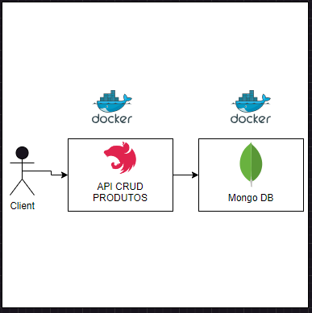

<p> <h1>Projeto de API para Gerenciamento de Produtos e Gerador de Piadas</h1>
</p>

[circleci-image]: https://img.shields.io/circleci/build/github/nestjs/nest/master?token=abc123def456
[circleci-url]: https://circleci.com/gh/nestjs/nest

  <p align="center">Desenvlvido por Leandro Machado Siqueira</p>


## Description

Este é um projeto NestJS que tem como objetivo disponibilizar uma API com funcionalidades CRUD para gerenciamento de produtos, bem como um gerador de piadas. Este documento fornece informações sobre como instalar, configurar e executar o projeto, além de detalhes sobre as tecnologias utilizadas e os testes implementados

## Observation
Foi utilizado o framework NestJS devido a agilidade no processo de desenvolvimento. Este framework oferece suporte total a TypeScript (mas ainda permite que os desenvolvedores codifiquem em JavaScript puro) e combina elementos de OOP (Programação Orientada a Objetos), FP (Programação Funcional) e FRP (Programação Funcional Reativa).

O NestJS vem por padrão configurado para utilizar o Express no backgroud, permitindo ainda ser alterado para a utilização do Fastify. Para esse projeto foi utilizada a configuração padão do framework conforme requisito do desafio.

Devido a tempo curto não foram tratadas algumas condições, como por exemplo a tipagem do retorno de certas funções bem como os testes cobriram apenas os casos basicos.

Melhorias que poderiam ser inseridas:
* A busca de produtos pode ser tratada para realizar a busca conforme o campo deseja, atualmente busca apenas pelo "id" do produto.
* Na busca geral inserir paginação e filtro
* Implanta a autenticação JWT utilizando o postgress
* Tratar melhor os logs para a utilização do grafana na observação e monitoramento da aplicação
* Os campos criado por e atualizado por poderia estão fixo com um numero simulando o id do banco de dados relacional.

## Infrastructure architecture


## Installation

```bash
$ npm install
```

## Running the app - Local

```bash
# development
$ npm run start

# watch mode
$ npm run start:dev

# production mode
$ npm run start:prod
```

## Running the app - Docker
```bash
docker-compose up -d
```

## Test
Para a melhor execução conforme a descrição seguir os passos execução via projeto local

```bash
# unit tests
$ npm run test

# e2e tests
$ npm run test:e2e

# test coverage
$ npm run test:cov
```

## Features
Este projeto oferece as seguintes funcionalidades:

CRUD (Create, Read, Update, Delete) de produtos.
Gerador de piadas.

## Technologies used
As principais tecnologias utilizadas neste projeto são:

* NestJS: Framework Node.js para construção de APIs.
* TypeScript: Linguagem de programação.
*MongoDB: Banco de dados utilizado para armazenar informações sobre os produtos.
* Jest: Framework de teste para testes unitários e de integração.
* Swagger: Documentação automática da API.

## Support

Nest is an MIT-licensed open source project. It can grow thanks to the sponsors and support by the amazing backers. If you'd like to join them, please [read more here](https://docs.nestjs.com/support).

## Stay in touch

- Author - [Leandro Machado Siqueira](https://www.linkedin.com/in/grafleandro/)


## License

Nest is [MIT licensed](LICENSE).
